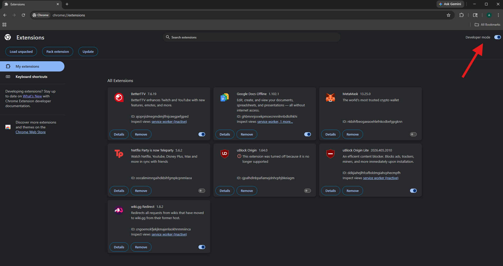

# CoTab: A Dynamic Tab-Sharing Browser Extension

## Introduction

### What is CoTab?

CoTab is a Chromium browser extension designed to help you share your tabs with your friends, colleagues, or even yourself (on different browsers or devices) without the hassle of constantly emailing urls or managing multiple shared screens. It is being developed as a part of my senior thesis work in computer science at Carthage College.

### What makes CoTab unique?

There are many extensions that allow you to capture a "snapshot" of your tabs and share that snapshot via a link. CoTab is different in that it focuses more on your browsing session as a whole; instead of only sharing your tabs at a specific point in time, CoTab allows you to add, remove, or update the tabs you share as you browse. Every user in a CoTab session can view and open the tabs you share, and CoTab even provides some extra features to help you organize tabs and follow along with what each user is doing.

## Getting started

Right now, CoTab is not an officially published browser extension. In other words, you cannot download it directly from the Chrome Web Store. This is because I do not have a good server infrastructure set up to handle any amount of users who may download it. Therefore, if you'd like to use CoTab yourself, you must host your own server (either on your own machine or through a VPS hosting site such as [Digital Ocean](https://www.digitalocean.com/products/droplets)). For the purpose of getting started, the instructions below assume you are hosting the server on your own machine.

### 1. Cloning the repository

Open your command line and navigate to the location on your computer you would like the repository to live. Then run

```console
> git clone https://github.com/alankwak/CoTab
```

to install the files onto your machine.

### 2. Setting up the server

Navigate to the `backend/` folder.

```console
> cd CoTab/code/backend
```

Make sure you have node installed, then install the required packages for the server.

```console
> node -v
v22.17.0
> npm install
```

Finally, start the server. **You will need to perform this step every time you want to use CoTab, assuming the server is not already running.**

```console
> node index.js
```

By default, the server is hosted on `http://localhost:3000`. If you just want to test CoTab on your local machine (for example, between browsers), you don't need to do any more work. If you want to use CoTab across devices, though, you will need to forward the port you are hosting the server on. There are a couple of ways to do this, but [this article](https://code.visualstudio.com/docs/debugtest/port-forwarding) explains how to do it easily through VS Code.

### 3. Building the extension code

First, navigate to the frontend folder. If you've been following along through these instructions, you can use the command below.

```console
> cd ../frontend
```

Again, you'll need to install required packages.

```console
> npm install
```

Now, CoTab needs to know where to find the backend server. The easiest way to do this is to create a `.env` file inside of `CoTab/code/frontend` with the following variable.

```properties
VITE_WS_SERVER_URL=<your_url_here>
```

If you're just testing CoTab on your local browsers, you should replace `<your-url-here>` with `http://localhost:3000`. If you port forwarded your server using VS Code, you should replace it with the "Forwarded Address" corresponding to port 3000 in the PORTS tab of the console. If you're hosting the server through a VPS hosting site, use the url or IP of the server.

Next, you need to build the extension. Do this by running the command below.

```console
> npm run build
```

This will create a `dist/` directory inside of `CoTab/code/frontend`. This directory will be used to actually load the extension onto your browser.

### 4. Loading the extension on your browser

The instructions below work for both Chrome and Brave, but should be relatively standard for other Chromium-based browsers.

Open your browser and navigate to wherever you manage your extensions. On Google Chrome, this is `chrome://extensions`. On Brave, this is `brave://extensions`. Make sure "developer mode" is turned on in the top right corner.



Next, click the "load unpacked" button in the top left corner. Select the `dist/` folder from step 3. CoTab should now appear in your list of extensions! You should mess around with the extension to make sure it is working. See [the how-to-use documentation](docs/how-to-use.md) for help. To test tab-sharing, repeat this step on a separate browser or browser profile and have both browsers join the same room.

### 5: Sharing with friends (optional)

If you've gone through the trouble of making your server available on the internet, you probably want to be able to use CoTab with other people on separate devices. Luckily, this is pretty easy to do! Just share your `dist/` folder and its contents with the people you want to be able to use CoTab with. This is probably most easily done via something like a .zip file. Then, each person needs to go through step 4 on their own browser to load the extension.